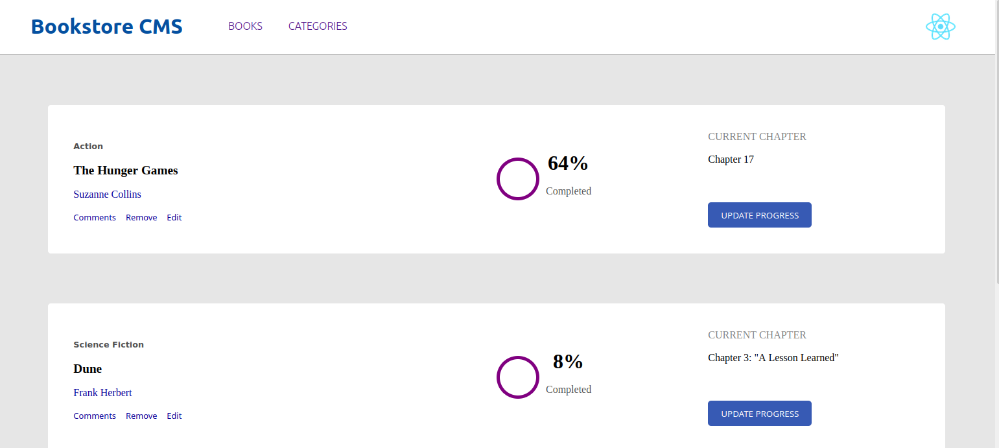

# Book Store

> An App where users can add and remove Books to a Library, filter them by category, and keep track of their 'readingprogress' and 'current chapter' aswell. 



## Live Demo

Check out this project live, click [here](https://eduardosancho.github.io/bookstore/)
<hr>

## Built With

- Major languages: JavaScript, CSS
- Technologies used: React, Redux, Webpack
<hr>


## Getting Started

To get a local copy up and running follow these simple example steps.

### Setup
Clone this repo into your local device by running the following command on your Terminal:
```
git clone https://github.com/eduardosancho/bookstore.git
```

That will create a folder with the project inside it. Navigate into it to access the files using `cd bookstore`.

Also remember to run:
```
npm install
```
This will update the dependencies and download necessary files.
<hr>

### Usage
Before you begin testing and experimenting, remember to use the Terminal to create a branch by running:
``
git checkout -b <branch-name>
``

Alternatively, if you use GitFlow, you can run the following command to create a new branch:
``
git flow feature start <branch-name>
``

Your branch should be ready now, lets get to work.

In the project directory, you can run:
### `npm start`

Runs the app in the development mode.\
Open [http://localhost:3000](http://localhost:3000) to view it in your browser.

The page will reload when you make changes.
You may also see any lint errors in the console.

<hr>

### Run Checks
Before pushing changes to your branch, I would recommend opening this file:

``
/.github/workflows/linters.yml
``

install and run stylelint, and eslint

These linters will help you fit your code to this repo's syntax standard.
<hr>

### Deployment
Once you're done with your changes, remember to ``git pull`` before doing ``git push``. 
This will update your local copy of the project if someone else made changes to the repo while you worked on your part.
<hr>

## Author

👤 **Eduardo Sancho Solano**

- GitHub: [@eduardosancho](https://github.com/eduardosancho)
- Twitter: [@sanchitobless](https://twitter.com/sanchitobless)
- LinkedIn: [Eduardo](https://www.linkedin.com/in/eduardo-sancho-043641181/)
<hr>

## 🤝 Contributing

Contributions, issues, and feature requests are welcome!

Feel free to check the [issues page](../../issues/).

<hr>

## Show your support

Give a ⭐️ if you like this project!
<hr>

## Acknowledgments

- Hat tip to anyone whose code was used
- Inspiration
- etc
<hr>

## 📝 License

This project is [MIT](./MIT.md) licensed.